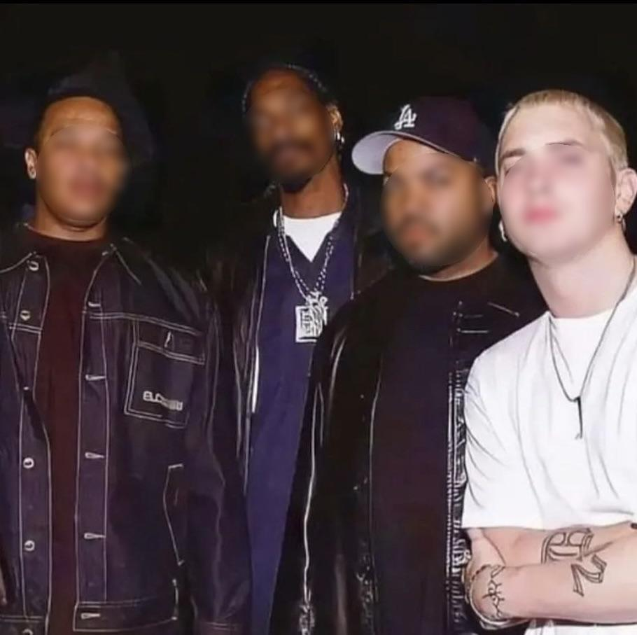
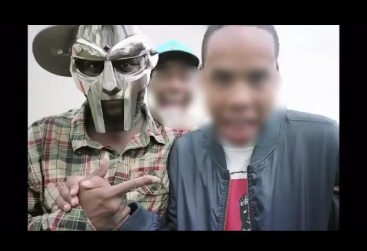
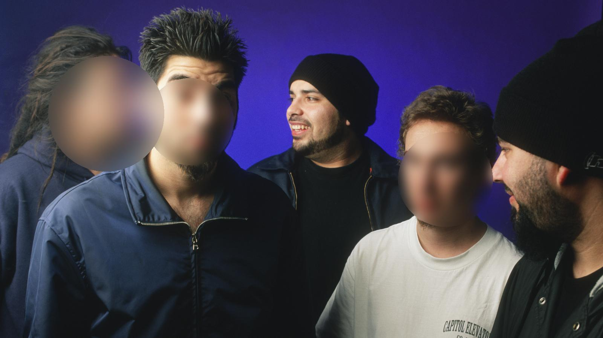

# Face Blurrer
By Neel Patel

Using [MediaPipe](https://developers.google.com/mediapipe/solutions/vision/face_detector) libraries and [code](https://github.com/googlesamples/mediapipe/blob/main/examples/face_detector/python/face_detector.ipynb), this face blurrer can detect faces and blur images accordingly.

## Examples



Face blurrer is not entirely accurate, and can miss faces if they are obstructed or not directly looking at the camera.







## Installation and Running
Install dependencies
```
pip install Pillow mediapipe
```
Clone Repository
```
git clone https://github.com/NotNeelPatel/face-blurrer && cd face-blurrer
```
Run face_blurrer
```
python3 face_blurrer.py /path/to/image
```
By default the output will save in `face-blurrer` as `{name_of_image}_blurred.{extension}` but you can specify what you want to call the output image.
```
python3 face_blurrer.py /path/to/image output.jpg
```


